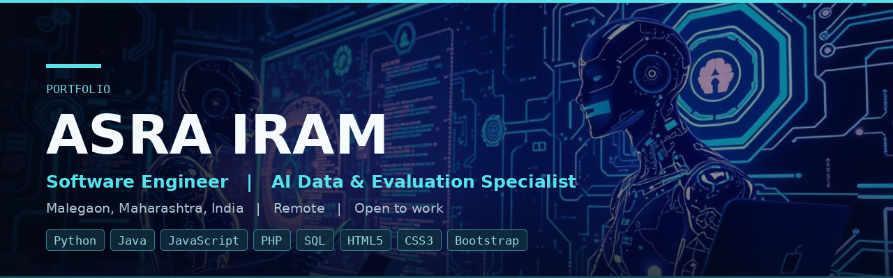

  
  
  
  

---

## About

Computer science graduate with nearly three years as a software engineer, building applications and the interfaces on top of them, and seven years of independent work on the data behind AI systems: annotation, model training, evaluation and search relevance.

Knowing how software is built and shipped, from the interface down to the database, makes for sharper judgement when assessing what it produces. I work remotely, to written guidelines, without supervision.

---

## Tech stack

**Languages**

  
  
  
  
  

**Front-end**

  
  
  
  

**Databases**

  
  
  

**AI data and evaluation**

  
  
  
  
  
  

---

## What I do

**Software engineering** - building application logic and the interfaces on top of it, and carrying a release through to client rollout and user acceptance.

**AI data and evaluation** - labelling, rating and validating the data that trains and measures language models and search systems, applying detailed written rubrics consistently across high volumes.

---

## Experience

### Software Engineer

`Finacus InfoTech Pvt. Ltd.` &nbsp; **Oct 2016 - Jun 2019**

- Developed and maintained server-side application modules in Python, Java and PHP, covering business logic, data processing and backend integration.
- Extended and refactored existing codebases, resolving defects and adding functionality against client requirements and delivery timelines.
- Developed and maintained responsive user interfaces in HTML5, CSS3 and Bootstrap, translating design specifications into production-ready screens.
- Verified layouts across browsers, resolutions and devices, resolving rendering and compatibility issues ahead of each release.

### AI Data Specialist and Evaluator

`Independent, remote contract work` &nbsp; **Jun 2019 - Present**

- Annotate and label text, image and audio data to client specification, holding quality against sampled audit review.
- Evaluate AI model responses for accuracy, relevance, tone and policy compliance, and write structured feedback that feeds back into training.
- Rate search results and search advertisements against published relevance guidelines, applying consistent judgement across high query volumes.
- Transcribe and translate text and speech, and review dubbing and lip-sync output for timing and naturalness.
- Validate AI training datasets, flagging mislabelled, ambiguous and out-of-guideline items before delivery.

---

## Core competencies

| Area | Detail |
| :-- | :-- |
| **Programming** | Python, Java, JavaScript, PHP, SQL |
| **AI and data** | Data annotation and labelling, AI model training, prompt evaluation, content review and quality rating, data validation |
| **Search evaluation** | Search relevance rating, search engine evaluation, search advertisement quality rating |
| **Linguistic** | Transcription, translation, dubbing and lip-sync review, multilingual evaluation |
| **Front-end** | HTML5, CSS3, Bootstrap, responsive layout, cross-browser verification |
| **Databases** | MS-SQL Server, MySQL, MySQL Workbench, SQL for data preparation and validation |
| **Software delivery** | Implementation and rollout, requirement gathering, client onboarding, UAT |
| **Languages** | English, Hindi, Marathi, Urdu |

---

## Education

**Bachelor of Science - Computer** &nbsp; `Oct 2015`

J.A.E.T. Society's Arts, Science and Commerce Girls College, Malegaon (Savitribai Phule Pune University)
 First Class, with Computer Science as subsidiary subject

**Higher Secondary Certificate (HSC)** and **Secondary School Certificate (SSC)**

The Malegaon High School and Jr. College, Maharashtra State Board

---

## Contact

  
  

Available for remote AI data and evaluation work, and for software engineering roles.
